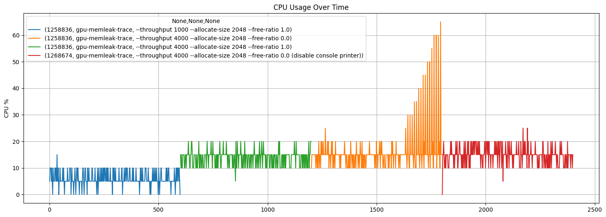
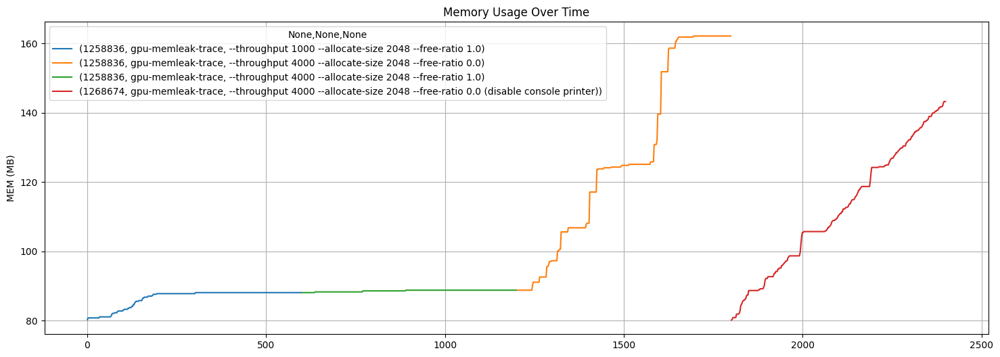

# Stress test gpu-memleak-trace trace

In this experiment, we perform the following actions:

- Create a Python script that spams malloc/free events on the GPU server
- Run gpu-memleak-trace to capture those events
- Check and analyze the tool’s performance when handling high-throughput
  data (using script/pid_monitor_csv.py to export metrics of the trace
  process PID)

## Envinroment

``` sh
root@gpu1 ~/g/script (dev)# ./basic-info.sh 
==============================
 🖥️  System & Kernel Info
==============================
Linux 6.11.0-26-generic #26~24.04.1-Ubuntu SMP PREEMPT_DYNAMIC Thu Apr 17 19:20:47 UTC 2 x86_64 x86_64 x86_64 GNU/Linux

Operating System: Ubuntu 24.04.2 LTS
          Kernel: Linux 6.11.0-26-generic
    Architecture: x86-64
 Hardware Vendor: ASUSTeK COMPUTER INC.
  Hardware Model: ROG STRIX X570-F GAMING
Firmware Version: 5031
   Firmware Date: Mon 2025-01-13
    Firmware Age: 7month 4w

==============================
 📦 Distribution Info
==============================
PRETTY_NAME="Ubuntu 24.04.2 LTS"
NAME="Ubuntu"
VERSION_ID="24.04"
VERSION="24.04.2 LTS (Noble Numbat)"
VERSION_CODENAME=noble
ID=ubuntu
ID_LIKE=debian
UBUNTU_CODENAME=noble

==============================
 💾 Hardware Info
==============================
Architecture:                         x86_64
CPU(s):                               32
On-line CPU(s) list:                  0-31
Model name:                           AMD Ryzen 9 5950X 16-Core Processor
BIOS Model name:                      AMD Ryzen 9 5950X 16-Core Processor             Unknown CPU @ 3.4GHz
Thread(s) per core:                   2
Socket(s):                            1
CPU(s) scaling MHz:                   28%
NUMA node0 CPU(s):                    0-31

               total        used        free      shared  buff/cache   available
Mem:           125Gi        78Gi        47Gi        25Mi       2.2Gi        47Gi
Swap:           27Gi        20Gi       7.5Gi

Filesystem                                        Size  Used Avail Use% Mounted on
total                                              93T  1.6T   92T   2% -

==============================
 🎮 GPU Info
==============================
[NVIDIA GPUs detected]
GPU 0: NVIDIA GeForce RTX 5090 (UUID: GPU-47def375-4603-e5fa-82d3-c7cddc81e65a)

0, NVIDIA GeForce RTX 5090, 570.133.07, 32607, 4492, 27620, 0
```

``` python
import pandas as pd
import numpy as np
import matplotlib.pyplot as plt
from tabulate import tabulate
```

## Run stressor

To validate and benchmark the tracing system, we generated synthetic GPU
memory allocation/free events using the stressor script.

In the eBPF program, we declare a ring buffer with a capacity of 16 MB
to handle the data.

``` python
!python ../script/gpu_stressor.py --throughput 4000 --allocate-size 2048 --ratio 1.0
```

    Running GPU stress generator: 4000 events/sec, alloc_size=2048 bytes, free ratio=1.0

    Exiting stress generator
    ^C

Trace result:

``` python
!../bin/gpu-memleak-trace --trace-print
```

    time=2025-09-15T21:47:32.441+07:00 level=INFO msg="eBPF program running... Press Ctrl+C to exit."
    time=2025-09-15T21:47:32.441+07:00 level=INFO msg="Running in DEBUG mode: ignoring --trace-print and --export-metrics"
    --- Scan Time: 2025-09-15 21:47:38 ---

    PID=1377235 TID=1377235 UID=0 DEV=0 Comm=python -> TotalSize=9.25 MB LastTs=2025-09-15 21:47:38.441759091
    Top allocations for TID=1377235:
      Size=2.00 KB, Ptr=0x00007eb5c3000000
      Size=2.00 KB, Ptr=0x00007eb5c3000800
      Size=2.00 KB, Ptr=0x00007eb5c3001000
      Size=2.00 KB, Ptr=0x00007eb5c3001800
      Size=2.00 KB, Ptr=0x00007eb5c3002000

    --- Scan Time: 2025-09-15 21:47:40 ---

    PID=1377235 TID=1377235 UID=0 DEV=0 Comm=python -> TotalSize=17.75 MB LastTs=2025-09-15 21:47:39.906348818
    Top allocations for TID=1377235:
      Size=2.00 KB, Ptr=0x00007eb5c3000000
      Size=2.00 KB, Ptr=0x00007eb5c3000800
      Size=2.00 KB, Ptr=0x00007eb5c3001000
      Size=2.00 KB, Ptr=0x00007eb5c3001800
      Size=2.00 KB, Ptr=0x00007eb5c3002000

    time=2025-09-15T21:47:45.883+07:00 level=INFO msg="Shutting down gracefully..."
    time=2025-09-15T21:47:45.890+07:00 level=INFO msg="All goroutines stopped."
    ^C

## Run monitor

Monitor CPU, Memory, DISK I/O by per PID and then export sample as CSV
format

``` sh
python pid_monitor_csv.py \
  --pids $(ps aux | grep trace-print | grep -v grep | awk '{print $2}') \
  --interval 0.2 \
  --duration 120 \
  --output ../sample/metrics.csv \
  --desc "--throughput 4000 --allocate-size 2048 --ratio 0.1"
```

Example result saved at: [metrics.csv](../sample/metrics.csv)

## Process sample

``` python
from datetime import datetime
ts = datetime.now().strftime("%Y-%m-%d %H:%M:%S.%f")
df = pd.read_csv('../sample/metrics.csv', parse_dates=["timestamp"]).query("name=='gpu-memleak-trace'")
print(tabulate(df.head(), headers="keys", tablefmt="github"))
```

    |    | timestamp                  | description                                             |     pid | name              |   cpu_percent |   memory_mb |   memory_percent |   disk_read_kb |   disk_write_kb |
    |----|----------------------------|---------------------------------------------------------|---------|-------------------|---------------|-------------|------------------|----------------|-----------------|
    |  1 | 2025-09-15 17:01:05.038128 | --throughput 1000 --allocate-size 2048 --free-ratio 1.0 | 1258836 | gpu-memleak-trace |             5 |        80.3 |              0.1 |           50.9 |               0 |
    |  3 | 2025-09-15 17:01:05.439754 | --throughput 1000 --allocate-size 2048 --free-ratio 1.0 | 1258836 | gpu-memleak-trace |            10 |        80.8 |              0.1 |           50.9 |               0 |
    |  5 | 2025-09-15 17:01:05.840861 | --throughput 1000 --allocate-size 2048 --free-ratio 1.0 | 1258836 | gpu-memleak-trace |            10 |        80.8 |              0.1 |           50.9 |               0 |
    |  7 | 2025-09-15 17:01:06.241972 | --throughput 1000 --allocate-size 2048 --free-ratio 1.0 | 1258836 | gpu-memleak-trace |            10 |        80.8 |              0.1 |           50.9 |               0 |
    |  9 | 2025-09-15 17:01:06.643099 | --throughput 1000 --allocate-size 2048 --free-ratio 1.0 | 1258836 | gpu-memleak-trace |             5 |        80.8 |              0.1 |           50.9 |               0 |

``` python
df.groupby(['pid', 'name', 'description'])['cpu_percent'].plot(figsize=(18, 6), grid=True, legend=True, ylabel='CPU %', title='CPU Usage Over Time')
```

    pid      name               description                                                                      
    1258836  gpu-memleak-trace  --throughput 1000 --allocate-size 2048 --free-ratio 1.0                              Axes(0.125,0.11;0.775x0.77)
                                --throughput 4000 --allocate-size 2048 --free-ratio 0.0                              Axes(0.125,0.11;0.775x0.77)
                                --throughput 4000 --allocate-size 2048 --free-ratio 1.0                              Axes(0.125,0.11;0.775x0.77)
    1268674  gpu-memleak-trace  --throughput 4000 --allocate-size 2048 --free-ratio 0.0 (disable console printer)    Axes(0.125,0.11;0.775x0.77)
    Name: cpu_percent, dtype: object



It appears that the tool consumes a significant amount of CPU when trace
results are printed to the console. (#TODO: performance optimization is
needed).

This overhead occurs because, as more memory is stored in the map
structure, the CPU must perform additional work to process the larger
dataset. In this experiment, **the workload was measured on a single CPU
core, even though the server has 32 cores available**. This means the
reported overhead reflects single-core performance, not full system
capacity. I have identified the Summary() and GetTopN() functions as the
main contributors to the overhead. Further investigation and
optimization will be performed in future iterations.

``` python
df.groupby(['pid', 'name', 'description'])['memory_mb'].plot(figsize=(18, 6), grid=True, legend=True, ylabel='MEM (MB)', title='Memory Usage Over Time')
```

    pid      name               description                                                                      
    1258836  gpu-memleak-trace  --throughput 1000 --allocate-size 2048 --free-ratio 1.0                              Axes(0.125,0.11;0.775x0.77)
                                --throughput 4000 --allocate-size 2048 --free-ratio 0.0                              Axes(0.125,0.11;0.775x0.77)
                                --throughput 4000 --allocate-size 2048 --free-ratio 1.0                              Axes(0.125,0.11;0.775x0.77)
    1268674  gpu-memleak-trace  --throughput 4000 --allocate-size 2048 --free-ratio 0.0 (disable console printer)    Axes(0.125,0.11;0.775x0.77)
    Name: memory_mb, dtype: object



In this result, let's consider each case:

- With a free ratio of 1.0, that means the tool does not need memory
  space to store leaked pointers, so memory usage will not increase
  significantly.
- With a free ratio of 0, the tool requires a data structure to store
  leaked pointers in memory, so memory usage will increase
  significantly. (#TODO: I will improve this later)

### Metrics report

``` python
```
